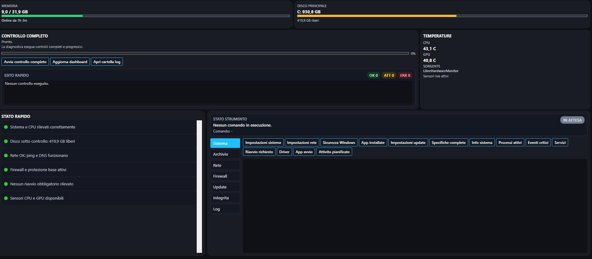
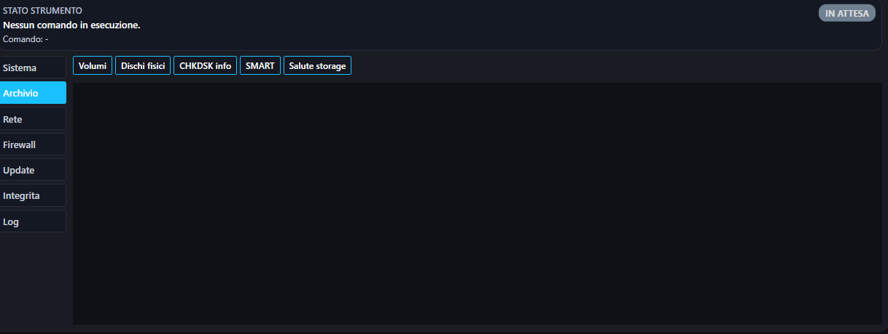
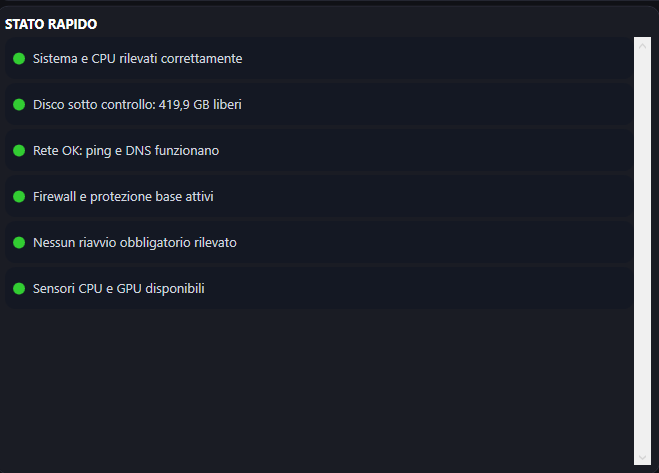

# Gaspar System Health

Desktop tool for Windows built with C# and WPF for diagnostics, system integrity checks, network analysis, updates, security checks, and hardware monitoring.



## Features

- compact dashboard with CPU, memory, disk, uptime, and temperatures
- full diagnostic flow with step-by-step progress
- tools for network, firewall, updates, integrity, storage, and logs
- antivirus definition status and Microsoft Defender quick scan
- hardware sensor support through LibreHardwareMonitor



## Requirements

- Windows 10 or Windows 11
- administrator privileges
- compatible .NET Desktop Runtime

## Temperature Sensors

If LibreHardwareMonitor is not already present next to the executable, the app can try to download it automatically on first launch.



## Project Structure

- `App.xaml`
- `MainWindow.xaml`
- `MainWindow.xaml.cs`
- `Models/`
- `Services/`
- `app.manifest`
- `GasparSystemHealth.csproj`

## Build

```powershell
dotnet build .\GasparSystemHealth.csproj -c Release
dotnet publish .\GasparSystemHealth.csproj -c Release -o .\publish
```

## Release

The recommended way to distribute the app is through GitHub or GitLab releases with a packaged build attached as a zip file.

## Third-Party Notice

This project uses LibreHardwareMonitor for hardware sensor support.

- LibreHardwareMonitor: https://github.com/LibreHardwareMonitor/LibreHardwareMonitor
- License: Mozilla Public License 2.0 (MPL-2.0)

Please keep the related attribution and license files with the distributed package when LibreHardwareMonitor components are included.

# License

Gaspar System Health source code is distributed under the Apache License 2.0.

This project also uses third-party components, including LibreHardwareMonitor for hardware sensor support. LibreHardwareMonitor is distributed under the Mozilla Public License 2.0 (MPL-2.0).

Relevant attribution and third-party licensing materials are included in:

- `THIRD-PARTY-NOTICES.md`
- `licenses/LibreHardwareMonitor-LICENSE.txt`
- `licenses/LibreHardwareMonitor-THIRD-PARTY-NOTICES.txt`

Gaspar System Health is built with Microsoft development tooling and Windows platform frameworks. Microsoft tools, SDKs, and platform components remain subject to their respective Microsoft terms and are not relicensed by this project.
